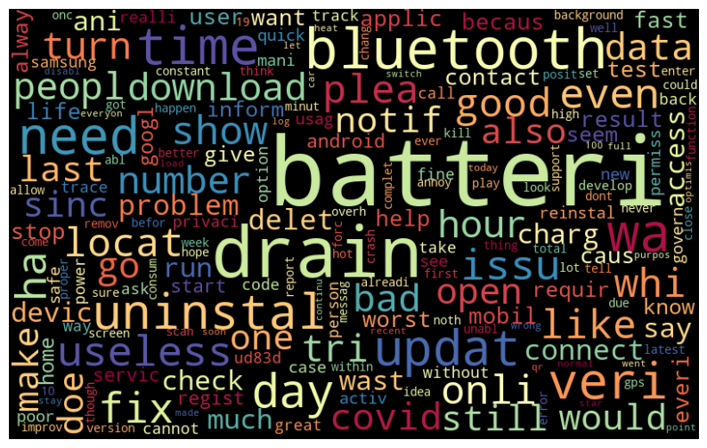

# Classic ML for NLP. Ternary Classification

**[MLZoomcamp](https://github.com/alexeygrigorev/mlbookcamp-code/tree/master/course-zoomcamp) midterm project**  
**by Simon Ilishaev**  
simon.ilishaev@gmail.com



## 1.Description

Project gives a brief example of a classic nlp with **nltk** and **sklearn** based on [A Benchmark Dataset for Sentiment Analysis of Users' Reviews on COVID-19 Contact Tracing Applications](https://dataverse.harvard.edu/dataset.xhtml?persistentId=doi:10.7910/DVN/1RDRCM).

Task consists in classifying users's reviews into right category out of the three: **postive reviews = 0**,  **negative reviews = 1**, **technical issues = 2**.

For the analysis were chosen **Logistic Regression** and **Gradient Boosting** as promiment classic ML models not considered in the [related publication](https://arxiv.org/abs/2103.01196).

For learning purposes best chosen model was deployed with [bentoml](https://www.bentoml.com/) and [Yandex Serverless Containers](https://cloud.yandex.com/en/docs/serverless-containers/operations).

Data for modeling:

* t1_data_test.tsv
* t1_data_train.tsv

Clone repository and export conda environment to play with repo:

```zsh
conda env create -n ENVNAME --file environment.yml
```

## 2. Modeling approach

**Preprocessing**:

* Cleaning text from punctuation and stopwords.
* [Stemming and lemmatization.](https://nlp.stanford.edu/IR-book/html/htmledition/stemming-and-lemmatization-1.html#:~:text=%20Stemmers%20use%20language-specific%20rules%2C%20but%20they%20require,Particular%20domains%20may%20also%20require%20special%20stemming%20rules.)
* Tokenization: raw string splitted into the tokens.
* [N-grams](https://en.wikipedia.org/wiki/N-gram) selection.
* Vectorization with [tf-idf.](https://en.wikipedia.org/wiki/Tf%E2%80%93idf)

**Hyperparameter tuning**:

* Model parameters were tuned with **grid search cross-validation** in a unified **pipeline**.

**Model assessment and selection**:

* Models were assessed with a **weighted AUC** and **f1 score**.

## 3. Results

Both models show performance better than other classic ML classifiers considered in [related publication](https://arxiv.org/abs/2103.01196).

|Model|F1|
|-----|--|
|Logistic Regression|0.817|
|Gradient Boosting|0.822|
|SVM (from publication)|0.814|

XGBClassifier was selected for deployment.

## 4. Containerization with [BentoML](https://docs.bentoml.org/en/latest/tutorial.html)

(bentoml=1.0.0)

Assuming that model was saved (look at the [notebook](./sentiment_analysis.ipynb) part 5) and prediction [service](./sentiment.py) created, containerization requires several steps with cli:

* Check service locally (running on <http://0.0.0.0:3000> by default):

```zsh
bentoml serve sentiment.py:xgbc --production
```

* Create [bentofile.yaml](./bentofile.yaml) with specified versions of python libraries and additional [script](./setup.py) for uploading nltk_data needed for the model (change nltk.download part for deployment in Yandex Cloud as it commented in [setup.py](./setup.py) script).

* Build bento (in the folder with sentiment.py, bentofile.yaml & setup.py):

```zsh
bentoml build
```

* To find created bento tag use:

```zsh
bentoml list
```

* Create container (assumed that [docker](https://www.docker.com/) already installed):

```zsh
bentoml containerize <sentiment_classifier>:<YOUR TAG>
```

* Run container locally:

```zsh
docker run -it --rm -p 3000:3000 sentiment_classifier:<YOUR TAG>
```

## 5. Deployment with [Yandex Serverless Containers](https://cloud.yandex.com/en/docs/serverless-containers/operations)

<details>
  <summary>Screencast (Click it)</summary>

<video controls>
  <source src="./images/screencast.webm" type="video/webm">
</video>

</details>

Temporary URL: <https://bbah254r1kim16a93724.containers.yandexcloud.net/>

(Assuming that you already registered and have installed [Yandex Cloud CLI](https://cloud.yandex.com/en/docs/cli/quickstart#install))

* Create container registry:

```zsh
yc serverless container registry create --name <registry_name>
```

* Check registry list:

```zsh
yc container registry list
```

* Create IAM token:

```zsh
yc iam create-token
```

* Authorize with IAM token:

```zsh
docker login --username iam --password <IAM TOKEN> cr.yandex
```

* Rename docker image with appropriate prefix:

```zsh
docker image tag <OLD_NAME>:<OLD_TAG> cr.yandex/<your_registry_id>/<NEW_NAME>:<NEW_TAG>
```

* Push container to the registry:

```zsh
docker push <LONG_NAME>:<TAG>
```

* Create serverless container:

```zsh
yc serverless container create --name <NAME>
```

* Create container revision with prepared image and [service account ID](https://cloud.yandex.com/en/docs/iam/operations/sa/get-id):

```zsh
yc serverless container revision deploy \
  --container-name <container_name> \
  --image <Docker_image_URL> \
  --cores 1 \
  --memory 1GB \
  --concurrency 1 \
  --execution-timeout 30s \
  --service-account-id <service_account_ID>
```

* Check revision by container name

```zsh
yc serverless container revision list --container-name <container_name>
```

* Make it public

```zsh
yc serverless container allow-unauthenticated-invoke <container_name>
```

* Get an invocation link

```zsh
yc serverless container get <container_name>
